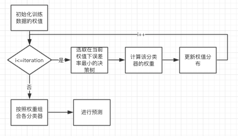
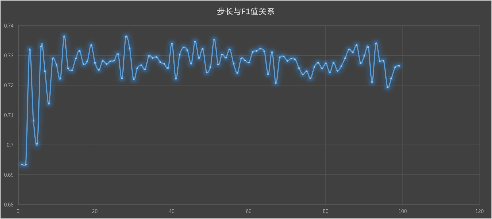

### 3、数据集分析

- 二元分类数据集分析

  |  属性  |                    说明                    |
  | :--: | :--------------------------------------: |
  | 第一列  |       其与标签联系较大，通过计算距离，该属性可以较好地区分标签       |
  | 第二列  |      第二列是一列说明type类型的标签，其与标签也有一定的关联度      |
  | 其他列  |           其他列属性较为神秘，暂时不能归纳出其特性           |
  | 所有列  | 观察发现其中离散属性有第2，11，12列;连续属性有第1，3，4，5，6，7，8，9，10，13列 |


### 4、集成学习方法(AdaBoost)

我们组是我在实现AdaBoost算法。最初在尝试PLA和LR算法无果后，即尝试使用AdaBoost算法。因为单层决策树是相对较常用的弱分类器，故决定使用AdaBoost算法加上决策树算法。其流程图如下所示：

<center></center>

关键代码如下所示：

1. 建立当前权重下的最佳决策树：

   因为数据集是有连续的属性值，故采用遍历的方法来得到最佳的阈值：

   ```python
   for i in range(n): #遍历所有的特征
           Min = data[:,i].min()
           Max = data[:,i].max()
           steprate = (Max-Min)/Step 
           for j in range(-1,int(Step)+1): 
               for k in ['smaller', 'greater']: #即在此阈值下用大于或者是小于
                   thresh = (Min + float(j) * steprate)
                   predict = singleDT(data,i,thresh,k) #使用单层决策树分类
                   error = mat(ones((m,1))) #1表示分类错误，0表示分类正确，初始化为全部分类错误
                   error[predict == labelMat] = 0 #如果分类标签正确，则变为0
                   newError = D.T*error  #乘以系数D
                   if newError < minError: #如果错误率变小，更新最佳决策树
                       minError = newError
                       bestClasEst = predict
                       trees['chara'] = i
                       trees['thresh'] = thresh
                       trees['bijiao'] = k
   ```


1. 单层决策树的实现就较简单，在大于或者小于阈值全部判断为一个标签即可

2. 利用AdaBoost建立强分类器：

   ```python
   for i in range(it):#it 是迭代次数
       besttree,error,prelabels = buildStump(dataMat,classLabels,D,steps) #在该权值下建立决策树
       alpha = float(0.5*log((1.0-error)/error))#计算弱分类器对应的权重
       besttree['alpha'] = alpha  #保存其权重
       weak.append(besttree) #保存弱分类器
       Z=2*math.sqrt(error*(1-error))
       zhishu = multiply(-1*alpha*mat(classLabels).T,prelabels) #自然底数的指数，为了更新D
       D = multiply(D,exp(zhishu)) #更新D
       D = D/Z
   return weak
   ```


1. 使用得到的决策树进行决策

   ```python
   m = shape(data)[0] #待分类数据的个数
   labels = mat(zeros((m,1))) #所有待分类数据的分类，全部初始化为正类
   for i in range(len(classifierArr)): #使用弱分类器
       classEst = singleDT(data, classifierArr[i]['chara'],\
                                 classifierArr[i]['thresh'],\
                                 classifierArr[i]['bijiao'])
       labels += classifierArr[i]['alpha']*classEst #预测的结果乘以对应的权重
   return sign(labels)#返回预测值
   ```

   ​


1. 效果比较

   | 步长                      | 决策树数量                   |
   | ----------------------- | ----------------------- |
   |  |  |

   可以看出，在遍历得到阈值时的不长会随着步长增加而波动，其最大值在步长为10；而决策树的个数即迭代次数到了80次之后就差不多收敛了，可以达到$0.74$左右。

因之后使用了KNN进行调参，故未再对AdaBoost算法进行优化。

