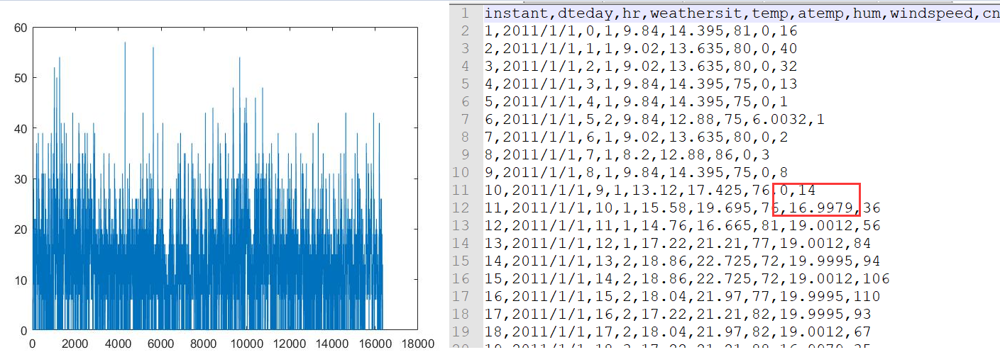
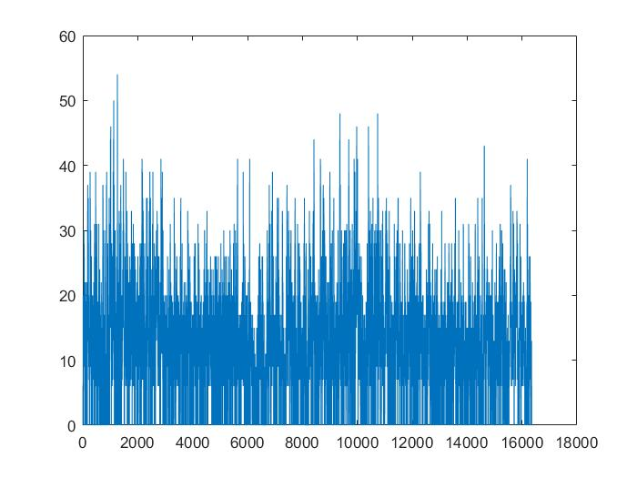
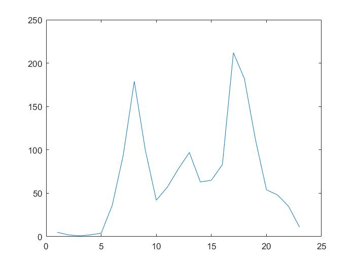
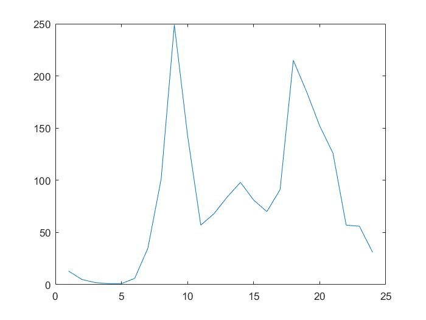
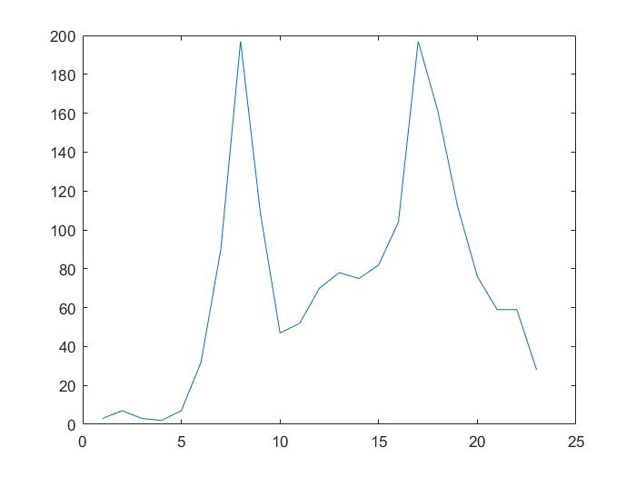
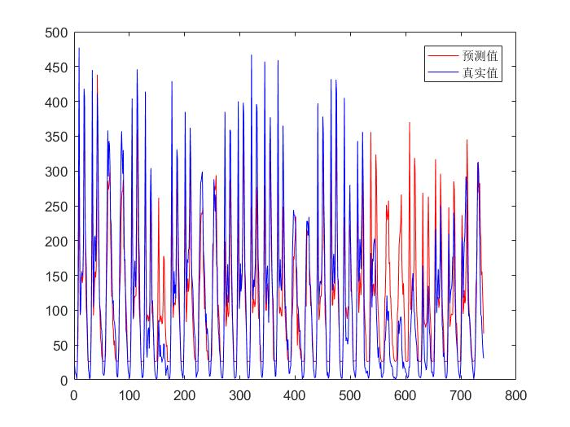
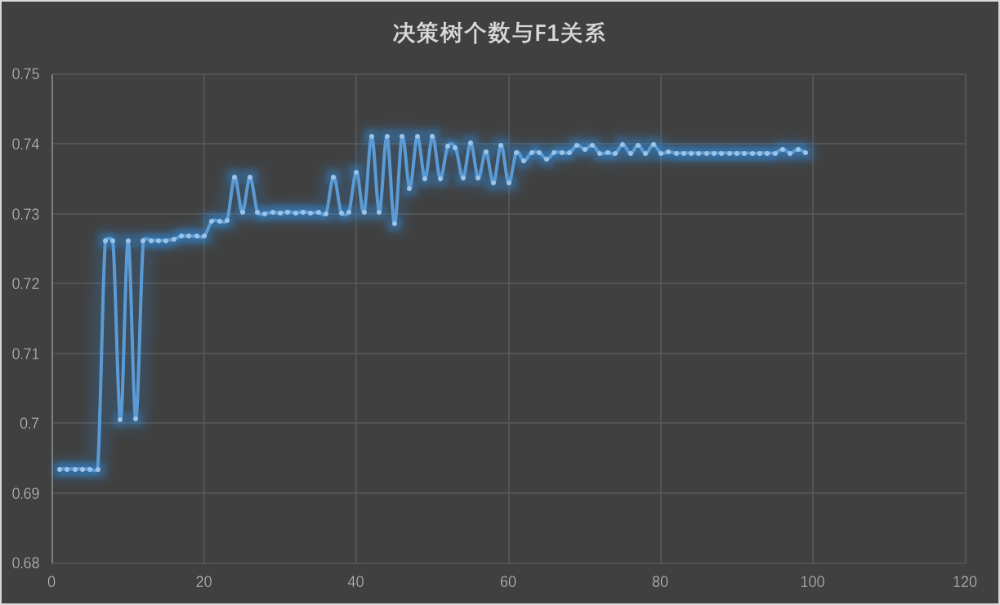

### 
中山大学数据科学与计算机学院

### 
移动信息工程专业-人工智能

### 
本科生项目报告

###
(2017-2018秋季学期)

---

课程名称：**Artificial Intelligence** 专业(方向)：移动互联网

| 教学班级 | 组号   | 组名    | 学号       | 姓名   |
| ---- | ---- | ----- | -------- | ---- |
| 15M1 | 5    | 给章鱼征婚 | 15352427 | 张子豪  |

---

###一、Project最终结果展示

1. 最终结果

   截止1月8日，我的小组rank情况如下，二元和多元结果可能还会有优化，但是我个人所负责的回归已经是最终结果。总排名为18。

   | 二元分类F1  | 二元分类排名 | 多元分类Acc  | 多元排名 |  回归RMSE  | 回归排名 |
   | :-----: | :----: | :------: | :--: | :------: | :--: |
   | 0.90872 |   21   | 0.600366 |  23  | 59.33084 |  13  |

2. 组内分工

   曹宇石负责二元分类问题

   张彧负责多元分类问题

   **我**负责**回归**问题

3. 个人工作

   * 17周——尝试多种模型(3层BPNN、4层BPNN、kNN)并得到一个比较基础的结果；准备17周pre
   * 18周——确定使用4层BPNN，分析数据集并增删属性，调整BPNN参数
   * 19周——基本结束回归问题，写报告

###二、工作流程

1. 算法简介

   这份表格的结果都是在未经任何处理的回归数据集上运行得到的结果，主要是为了确定使用哪个模型。优化数据集后我只在BPNN上跑了结果，拿那个结果放进表格里来与其他模型对比显然有失偏颇。

   | 使用模型 |   使用参数   | 验证集最优loss | 测试集最优loss |
   | :--: | :------: | :-------: | :-------: |
   | kNN  | k=9，余弦距离 |  127.326  |    125    |
   | BPNN |  4层神经网络  |  90.451   |    103    |

   最后最优的结果59.33是通过4层BPNN跑出来的，当然这其中对数据集进行了一点处理。

2. 调参过程

   开始做回归问题的时候，首先是考虑模型选取的问题，在我们学过的模型中个人认为kNN和BPNN在处理这个问题上比较方便，因此先简单尝试了这两个模型，得到的结果已经在上面的表格中展示了，这个阶段的最优结果是103。

   在确定使用4层BPNN进行训练后，开始在此基础上改进我的模型。

   首先是数据集中日期的处理，我考虑将年月日全部独热编码，然而得到的结果...emm

   |          | 独热编码前 | 独热编码后 |
   | -------- | :---: | :---: |
   | **RMSE** |  103  |  125  |

   得到的结果要差很多，因此放弃了将年月日独热编码，只采用三维属性分别表示年、月、日。

   ---

   由于这份数据集跟lab6我们所使用的数据集类似，但其中没有weekday这个属性，因此我在数据集中增加了weekday这一列属性来区分是否是周末，并将hour独热编码：

   |          | 增加weekday, hour独热编码前 | 增加weekday, hour独热编码后 |
   | -------- | :------------------: | :------------------: |
   | **RMSE** |         103          |          93          |

   ---

   在听其他同学pre的过程中了解到圣诞节左右的五天（也就是十二月最后十天）由于受到了圣诞节的影响，共享单车使用数量要普遍低于正常情况，因此在数据集中增加了一列属性用来区分是否是**十二月最后十天** 

   |          | 增加属性前 | 增加属性后 |
   | -------- | :---: | :---: |
   | **RMSE** |  93   |  87   |

   ---

   观察数据集中数据分布的特点，我发现windspeed这一列经常会有突然出现的大幅度上升，比如这个小时风速是0下个小时就到了好几十，而这显然是不符合常理的

   

   将这一列属性绘制成图如上左图，可以明显看到有很多毛刺，因此我对数据进行了一定处理，连续两个小时的风速上升的值超过20就认为是毛刺，将它的值变为前一个小时的值，处理的风速绘图如下

   

   很明显的看到那几列很突出的毛刺已经被处理掉了，且数据分布大体没有改变。

   选取了几个工作日的共享单车使用数量绘制成图如下

   |       工作日1        |       工作日2        |       工作日3        |
   | :---------------: | :---------------: | :---------------: |
   |  |  |  |

   一个很明显的特点呼之欲出了，工作日的“朝九晚五”时间段，是两个共享单车使用次数较高的时间段，因此在数据集中再添加一列属性来区分是否是工作日的朝九晚五，对数据集进行这两个处理之后，前后结果如下

   |          | 处理前  | 处理后  |
   | -------- | :--: | :--: |
   | **RMSE** |  87  |  80  |

   ---

   本以为我的回归可能就到此为止了，直到有一天我心血来潮用2011年的12月来作为验证集，然后将预测结果与真实结果比对

   

   于是我发现了有两个地方我的模型拟合的非常差，在12月7日左右模型预测的结果普遍高于真实值和在圣诞节附近十天模型预测的结果也普遍高于真实值。

   观察数据集中11年12月7日那天的属性，我并没有发现有什么特殊的地方导致这一天的真实值比前后几天低上很多，因此我没有对此进行处理。

   而对于圣诞节那十天，在我添加了一列属性来辨认是否是圣诞节左右五天的情况下依然要远远高于真实值，我认为圣诞节那段时间完全无法用其余一万多条数据去学习，它们之间完全是两种规律。

   于是我将模型分成了两个子模型，将11年12月最后11天的数据抽出来用于训练测试集中最后11天，也就是12年12月最后11天；将训练集中其余属性用于训练测试集中前20天，最后将两个结果整合。于是我就得到了我整个project中RMSE下降最多的一次改动，并且是在我没有对新模型进行任何调参优化的情况下得到的。

   |          | 改动前  | 改动后  |
   | -------- | :--: | :--: |
   | **RMSE** |  80  |  66  |

   ---

   接下来的工作就比较简单了，循环跑一遍取到loss最低的参数就可以了，但是由于我用的是4层BPNN，需要确定两个隐藏层的节点数，跑二重循环花费的时间太长了，所以我对两个隐藏层各跑了一次循环来取到它在这种情况下的最优的节点数。显然这样得到的不是最优解，但是毕竟爱惜电脑只能这样了，于是我得到了我最后的结果

   |          | 调参前  | 调参后  |
   | -------- | :--: | :--: |
   | **RMSE** |  66  |  59  |
   (实际上这个结果应该还能再往下降一点，因为我的数据集中没有添加“节假日”这一列属性，但是留给我的时间已经不多了...复习要紧)

   ---

3. 数据集分析

   二元数据集：

   1. 第一列与标签关联较大，也就是说该属性对标签的影响较大

   2. 第二列为文本类型，表明该文本是五种type中的哪种type

      （由于第二列是离散值，且typeA和typeE对标签的影响非常大，大概是只要是这个type那么标签就一定会是+1（-1），因此我向负责二元的队友提了一个建议，将整个数据集按照不同type分成五个子数据集，对于测试集的每个样本，根据它的type来选择对应的子数据集跑KNN算法进行预测。不过队友换了曼哈顿距离上了0.9之后好像就没有试这个方法了...所以我也是只是提了一个建议）

   3. 特征为离散值的有第2、11、12三列，其余特征均为连续值

   $$\ $$

   多元数据集：

   1. 各标签样本数目占比情况

      |  LOW   |  MID   |  HIGH  |
      | :----: | :----: | :----: |
      | 19298个 | 26057个 | 17167个 |
      | 30.78% | 41.68% | 27.46% |

   2. 不重复单词共有90297个，也就是说直接处理成矩阵有接近十万维，计算起来很困难，需要降维

   3. 不同标签之间的样本分布不均匀，MID占比要多一些

   $$\ $$

   回归数据集：

   1. 存在无用数据，即每个月结束后都会有一行特征全0结果很大的数据，其实是这个月的单车使用数量总和
   2. 某些特征属性存在噪声，需要通过一些方法去噪
   3. 圣诞节附近的几天完全无法用其他时间段的数据去训练，这样做预测的偏差会很大

4. 集成学习方法(AdaBoost)

   我们小组在二元分类问题上使用了AdaBoost。

   我对AdaBoost的来理解是对于一个弱分类器，根据每次迭代过程中每个样本分类是否正确以及这次迭代过程中分类器的准确率，来更新数据集中每个数据点的权值，将更新权值后的数据集送给下个分类器进行训练直至迭代结束。最后将每次得到的分类器整合起来，通过加权的方式得到最后预测的结果，分类器的权值是它的错误率。

   我们小组基于单层决策树使用了AdaBoost，由于属性为连续值，因此我们只是简单的设定了一个阈值，大于或小于该阈值全部判断为一个标签即可。流程图如下

   

   AdaBoost对弱分类器的提升效果如下，横轴为训练的弱分类器个数

   

   单层决策树的基础F1也有0.6多了，严格意义上来说并不能算弱分类器，使用AdaBoost后大约提升至0.74就已经收敛。

### 三、引用

无

### 四、课程总结

一学期下来AI这门课应该是花费时间最多的一门课，但也的确学到了很多东西。但是project的模式我个人是觉得非常非常不合理的，就我负责的回归来说，给的训练集是两年的前23个月，要预测最后一个月，但是实际上最后这一个月里圣诞节附近的那段时间是完全不能从前23个月来学习的，再加上高比重的rank，所以最后我们做的工作实际上都是在这份测试集上过拟合。

然后就是算法问题，跟其他人交流一下很容易就能知道这个数据集最适合的模型是什么，比如二元最适合的模型是KNN，回归最适合的模型是BPNN。那么问题来了，我现在知道这个模型能对我rank的提升帮助是最大的，假如我花费大量时间去了解一个新模型的原理然后实现它，得到的结果很大几率不会比我现在用的模型优秀，也就是说我投入的这些时间最多只能换来报告部分的10%左右的加分，而rank是占了40%的，可以说是完完全全的沉没成本，相信ta们也知道学期末这段日子的时间很紧张。我的付出和回报完全不成正比，在rank占比极高的情况下我花时间去实现新算法可以说是“亏本”的，特别是在我已经用现有的模型跑出了一个不错的rank的情况下，去实现新算法的动力其实很低很低。

经过这一个学期的学习，对于机器学习这方面的知识也了解到了很多，实现算法最重要的部分应该是彻底弄懂算法的原理，这样才能确保自己能写出正确的代码。我在写BPNN的时候就因为一开始没有弄懂反向传播的过程中是如何推导得到那个公式的，所以代码一直都写不对，在了解原理之后再写就觉得豁然开朗了很多。

至于如何判断自己的算法实现是否正确，这里就应该是通过划分验证集来观察模型在验证集上的表现是否符合预期，或者使用小数据集进行测试，小数据集对于测试模型是否实现正确和了解算法原理真的有很大帮助。一般来说划分验证集可以从原数据中随机抽取3成左右作为验证集，其余作为训练集，但是对于这次project回归问题就不能这样做了，毕竟12月的数据跟其他月的数据并不相同，我甚至有过在验证集上RMSE=53，交上去跑测试集RMSE=125的经历，当时就懵了。

这门课的实验到这里已经彻底结束了，还是要感谢ta们，虽然只是各尽其职，但是真的很负责，笔芯(´･ᴗ･`) 

