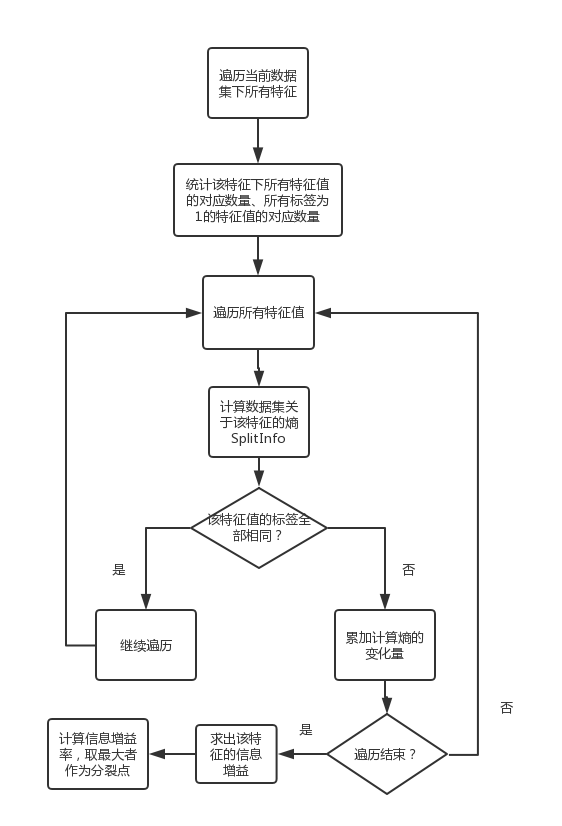

### <center>中山大学数据科学与计算机学院</center>

### <center>移动信息工程专业-人工智能</center>

### <center>本科生实验报告</center>

###<center>(2017-2018秋季学期)</center>

-------

|  姓名  |    学号    | 教学班级 |          课程名称           | 专业方向  |
| :--: | :------: | :--: | :---------------------: | :---: |
| 张子豪  | 15352427 | 15M1 | Artificial Intelligence | 移动互联网 |

-----


###一、实验题目

决策树

###二、实验内容

####1.算法原理

​	决策树作为一种树状结构的判决模型，其中每个非叶节点都表示一种特征属性，每个分支表示这个特征属性在其值域上的输出；而每个叶子节点则表示判决结果。判决时只需从上至下遍历决策树，在每个节点的分支中找到符合待测数据属性的分支继续遍历，直至到达叶子节点获得判决结果。

​	决策树的构造过程中，需要度量属性选择来获得一个划分元组成不同的类的属性的最优解，这一步的目标是让各个分裂出的子集中待分类项尽可能属于同一类别。而最优决策树的构造是NP难问题，因此一般使用自顶向下递归分支法，并采用不回溯的贪心策略。本次实验使用$$ID_3​$$ 、$$C4.5​$$ 、$$CART​$$ 三种算法。

(a) $$ID_3$$

​	$$ID_3$$ 算法根据**信息增益**来度量属性选择，选择分裂后信息增益最大的属性进行分裂。$$ID_3$$ 算法选择熵变化最大的，也就是**熵减少最多**的，即信息增益最大。

​	$$ID_3$$ 算法首先需要计算数据集的经验熵H(D) ：

​	$$H(D)=-\sum_{d\in D}p(d)log_2p(d)$$

​	 对于特征A，计算其对于整个数据集的条件熵H(D|A) , 即期望信息：

​	$$H(D|A)=\sum_{a\in A}p(a)H(D|A=a)$$

​	信息增益g(D,A)=H(D)-H(D|A)，$$ID_3$$ 算法选择信息增益最大的点作为分裂点。

(b) C4.5

​	C4.5算法基于$$ID_3$$算法，根据**信息增益率**来度量属性选择。C4.5算法对于多值属性和单值属性都有较好表现，基于熵变化速率，选择**熵变化速率最大**的点。基于$$ID_3$$ ，计算数据集D关于特征A的值的熵SplitInfo(D,A) ：

​	$$SplitInfo(D,A)=-\sum_{i=1}^{D}\frac{|D_i|}{|D|}*log_2(\frac{|D_i|}{|D|})$$ 

​	则信息增益率gRatio(D,A) :

​	$$gRatio(D,A)=\frac{H(D)-H(D|A)}{SplitInfo(D,A)}$$ 

​	C4.5算法选择信息增益率最大的点作为分裂点。

(c) CART

​	CART(Classification And Regression Tree)算法是一种二分递归分割技术，将数据集划分为两个子数据集，使得每个非叶节点都有两个分支。而在这次实验中，我实现的是多叉树，因此在实现过程中，对于特征A的某个取值$$A_j$$，将数据集分为$$(D|A=A_j)$$ 和$$(D|A\ne A_j)$$ 两部分，然后计算GINI系数，gini系数越小则表示不确定性越小，选择不确定性最小的特征作为决策点。

​	GINI系数$$gini(D,A)=\sum_{j=1}^{v} p(A_j)*gini(D_j|A=A_j)$$ 

​	其中$$gini(D_j|A=A_j)=\sum_{i=1}^np_i(1-p_i)=1-\sum_{i=1}^n p_i^2$$ 

​	当$$p_i=1$$  时，也就是说所有样本都属于同类的时候，$$gini(D_j|A=A_j)$$ 最小，也就是说该特征下的数据集“纯度”很高；而当所有样本等概率出现的时候$$gini(D_j|A=A_j)$$最大，也就是说数据集“纯度”很低。这也是为什么$$gini(D_j|A=A_j)$$ 被称为不纯度的原因。

$$\ $$

$$\ $$

$$\ $$

####2.伪代码

完整的决策树算法流程如下：

step1: 读取数据

step2: 初始化根结点

step3: 递归建树

step4: 评估模型，计算准确率

$$\ $$

递归建树的流程图如下：


$$\ $$

$$\ $$

$$\ $$

$$ID_3$$算法：


$$\ $$

$$\ $$

$$\ $$

$$\ $$

C4.5算法：



$$\ $$

CART算法：


$$\ $$

$$\ $$

$$\ $$

$$\ $$

$$\ $$

$$\ $$

$$\ $$

$$\ $$

####3.关键代码截图(带注释)

建树部分的代码如下，传入根结点建树，根结点初始化时包含了数据集的所有数据

```c++
void Build_Tree(TNode* root) {
	if (root->remain_property.size() != 0&&root->data_set.size()!=1) { //非叶子节点
		int chosen_attr = choose_attr(root->data_set, root->remain_property, 1);//选择分裂点
		root->property_i = chosen_attr;
		map<int, int> attr;//特征值-该特征值出现次数
		for (int i = 0; i < root->data_set.size(); i++) { //划分数据集
			if (!attr[root->data_set[i].DataProperty[chosen_attr]]) { //这个属性值第一次出现
				TNode* tmp = new TNode;//新建一个孩子节点
				tmp->property_res = root->data_set[i].DataProperty[chosen_attr];
				tmp->remain_property = root->remain_property;
				for (vector<int>::iterator it = tmp->remain_property.begin(); it != tmp->remain_property.end(); it++) { //子节点剩余属性中删去被选中的
					if (*it == chosen_attr) {
						tmp->remain_property.erase(it);
						break;
					}
				}
				tmp->data_set.push_back(root->data_set[i]);//填充数据集
				tmp->res = 999;//表示是非叶节点
				tmp->level = root->level + 1;//树的深度
				root->children.push_back(tmp);
				attr[root->data_set[i].DataProperty[chosen_attr]]++;
			}
			else { //这个属性值不是第一次出现
				for (int j = 0; j < root->children.size(); j++) { //遍历孩子，将这行数据填充进去
					if (root->children[j]->property_res == root->data_set[i].DataProperty[chosen_attr]) {
						root->children[j]->data_set.push_back(root->data_set[i]);
					}
				}
			}
		}
		//遍历孩子递归建树
		for (int i = 0; i < root->children.size(); i++) Build_Tree(root->children[i]);
	}
	else { //叶子节点
		int num_true = 0, num_false = 0;
		for (int i = 0; i < root->data_set.size(); i++) {//投票决定孩子的标签
			if (root->data_set[i].label == 1) num_true++;
			else num_false++;
		}
		if (num_true >= num_false) root->res = 1;
		else root->res = -1;
	}
}
```

ID3算法：

```c++
double max_gain = 0;//最大信息增益，初始化为0
for (int i = 0; i < remain_property.size(); i++) { //遍历所有种类特征
	map<int, int> num_class;//特征值-该特征值数量，例如age<=30, 30<age<50, age>=50
	map<int, int> num_true_class;//特征值-该特征值对应标签为1的数量
	for (int j = 0; j < v.size(); j++) {
		num_class[v[j].DataProperty[remain_property[i]]]++;
		if (v[j].label == 1) num_true_class[v[j].DataProperty[remain_property[i]]]++;
	}
	double gain = 0;//当前特征下的条件熵
	for (map<int, int>::iterator it = num_class.begin(); it != num_class.end(); it++) {
		if (num_true_class[it->first] == 0) continue;
		else if (num_true_class[it->first] == it->second) continue;
		else {
			gain += (it->second*1.0 / v.size())*(-(num_true_class[it->first] * 1.0 / it->second)*log2(num_true_class[it->first] * 1.0 / it->second) - ((it->second - num_true_class[it->first])*1.0 / it->second)*log2((it->second - num_true_class[it->first])*1.0 / it->second));
		}
	}
	if (entropy_class - gain > max_gain) { //该特征的信息增益较大
		max_gain = entropy_class - gain;
		ret = remain_property[i];
	}
}
return ret; //返回分裂点
```

C4.5算法：

```c++
double max_gain_ratio = 0;//最大信息增益率，初始化为0
for (int i = 0; i < remain_property.size(); i++) { //遍历所有种类特征
	map<int, int> num_class;//特征值-该特征值数量，例如age<=30, 30<age<50, age>=50
	map<int, int> num_true_class;//特征值-该特征值对应标签为1的数量
	for (int j = 0; j < v.size(); j++) {
		num_class[v[j].DataProperty[remain_property[i]]]++;
		if (v[j].label == 1) num_true_class[v[j].DataProperty[remain_property[i]]]++;
	}
	double gain = 0,split=0; //该特征的条件熵与该特征的熵
	for (map<int, int>::iterator it = num_class.begin(); it != num_class.end(); it++) {
		split += -1 * (it->second*1.0 / v.size())*log2(it->second*1.0 / v.size());
		if (num_true_class[it->first] == 0) continue;
		else if (num_true_class[it->first] == it->second) continue;
		else {
			gain += (it->second*1.0 / v.size())*(-(num_true_class[it->first] * 1.0 / it->second)*log2(num_true_class[it->first] * 1.0 / it->second) - ((it->second - num_true_class[it->first])*1.0 / it->second)*log2((it->second - num_true_class[it->first])*1.0 / it->second));
		}
	}
	if ((entropy_class - gain)/split > max_gain_ratio) { //该特征的信息增益率较大
		max_gain_ratio = (entropy_class - gain) / split;
		ret = remain_property[i];
	}
}
return ret;//返回分裂点
```

CART算法：

```c++
double min_gini = 9999;//最小gini系数，初始化为9999
for (int i = 0; i < remain_property.size(); i++) { //遍历所有种类特征
	map<int, int> num_class;//特征值-该特征值数量，例如age<=30, 30<age<50, age>=50
	map<int, int> num_true_class;//特征值-该特征值对应标签为1的数量
	int num_true = 0;//这个数据集一共有多少标签为1
	for (int j = 0; j < v.size(); j++) {
		num_class[v[j].DataProperty[remain_property[i]]]++;
		if (v[j].label == 1) {
			num_true_class[v[j].DataProperty[remain_property[i]]]++;
			num_true++;
		}
	}
	int num1 = num_class[remain_property[i]], num2 = v.size() - num1;
	int true1 = num_true_class[remain_property[i]], true2 = num_true - true1;
	int false1 = num1 - true1, false2 = num2 - true2;
	double gini;// 当前特征的gini系数
	if (num1 == 0) {
		gini= (num2*1.0 / v.size())*(1 - (true2*1.0 / num2)*(true2*1.0 / num2) - (false2*1.0 / num2)*(false2*1.0 / num2));
	}
	else if (num2 == 0) {
		gini = (num1*1.0 / v.size())*(1 - (true1*1.0 / num1)*(true1*1.0 / num1) - (false1*1.0 / num1)*(false1*1.0 / num1));
	}
	else gini = (num1*1.0 / v.size())*(1 - (true1*1.0 / num1)*(true1*1.0 / num1) - (false1*1.0 / num1)*(false1*1.0 / num1)) + (num2*1.0 / v.size())*(1 - (true2*1.0 / num2)*(true2*1.0 / num2) - (false2*1.0 / num2)*(false2*1.0 / num2));
	if (gini < min_gini) { //该特征的gini系数较小
		min_gini = gini;
		ret = remain_property[i];
	}
}
return ret;//返回分裂点
```

$$\ $$

$$\ $$

$$\ $$

$$\ $$

$$\ $$

$$\ $$

使用决策树预测结果，即遍历决策树：

```c++
void Traverse_Tree(Data& vail) {
	queue<TNode*> q;
	q.push(root);
	while (!q.empty()) { //BFS遍历树
		TNode* t = q.front();
		q.pop();
		if (t->res ==1 || t->res==-1) { //当前节点是叶子节点，保存预测结果，退出BFS
			vail.label_from_predict = t->res;
			break;
		}
		int attr = vail.DataProperty[t->property_i];//这个数据集的第i个属性，i是这个节点的划分点
		bool flag = false;//为true则表示该节点的分支中存在这个数据该特征下的特征值
		for (int i = 0; i < t->children.size(); i++) {
			if (t->children[i]->property_res == attr) {
				q.push(t->children[i]);
				flag = true;
				break;
			}
		}
		if (!flag) {//该节点的分支下不存在该特征值
			int num_true = 0, num_false = 0;
			for (int i = 0; i < t->data_set.size(); i++) {
				if (t->data_set[i].label == 1) num_true++;
				else num_false++;
			}
			if (num_true >= num_false) vail.label_from_predict = 1;
			else vail.label_from_predict = -1;
			break;
		}
	}
}
```

####4.创新点 &优化(如果有)

* 在遍历决策树预测结果时，假如当前分支下不存在这份数据的特征值，即遍历无法继续进行下去，那么可以直接在这个节点进行投票，也可以在这些分支中选择最接近的一条分支继续遍历。使用过程中这二者的效果相差很小。

* 后剪枝——BFS遍历树的每个节点，如果将这个节点的孩子全部delete掉后模型在验证集上的准确率有上升，那么就把这个节点的孩子delete掉，否则就恢复这个节点然后继续遍历。代码如下 :

  ```c++
  void Pruning() {
  	double now_rate = rate;
  	queue<TNode*> q;
  	q.push(root);
  	while (!q.empty()) { //BFS遍历树
  		TNode* t = q.front();
  		q.pop();
  		vector<TNode*> children = t->children;
  		t->children.clear();//删掉孩子节点
  		int num_true = 0, num_false = 0;
  		for (int i = 0; i < t->data_set.size(); i++) {
  			if (t->data_set[i].label == 1) num_true++;
  			else num_false++;
  		}
  		if (num_true >= num_false) t->res = 1;
  		else t->res = -1;
  		Vail_model();//计算准确率
  		if (rate > now_rate) now_rate = rate; //结果有上升则更新最大准确率
  		else { //否则恢复节点
  			t->children = children;
  			if(t->children.size()!=0) t->res = 999;
  			for (int i = 0; i < t->children.size(); i++) q.push(t->children[i]);
  		}
  	}
  }
  ```

  ​

###三、实验结果及分析

####1.实验结果展示示例（可图可表可文字，尽量可视化）

小数据集展示，使用下面这份小数据集：

```
1,1,1
0,1,1
1,0,0
0,0,0
```

由于只有两个特征，因此进行一次特征选择就能构建出树。

ID3算法，很容易看出第一个特征的信息增益为0，第二个特征的信息增益为1，应该选择第二个特征，程序运行结果如下，这里选择的列数是从0开始计数，因此第三行输出了1：


C4.5算法，信息增益率同样为0和1，程序运行结果如下：


CART算法，第一个特征的gini系数应为0.5，而第二个特征的gini系数应为0，程序运行结果如下：


此外，为了确保自己建树没有出现bug，我写了一个BFS来输出树的每个节点的数据集大小、该节点剩余特征数量、该节点孩子数量，根据深度控制缩进，基本符合预期：


####2.评测指标展示即分析（如果实验题目有特殊要求，否则使用准确率）

按7:3的比例划分训练集与验证集，考虑到给的数据集根据标签有序排列，因此随机抽取七成作为训练集，剩余作为验证集。运行十次程序，取结果进行分析如下

ID3算法的评测指标如下：


未剪枝的模型十次结果的平均准确率为：0.6329   标准差为：0.0294

剪枝后的模型十次结果的平均准确率为：0.6987   标准差为：0.0339

C4.5算法的评测指标如下：


未剪枝的模型十次结果的平均准确率为：0.6257  标准差为：0.0277

剪枝后的模型十次结果的平均准确率为：0.6857  标准差为：0.0352

CART算法的评测指标如下：


未剪枝的模型十次结果的平均准确率为：0.6105  标准差为：0.0310

剪枝后的模型十次结果的平均准确率为：0.6650  标准差为：0.0419

可以看出，没有任何优化的决策树模型的准确率约在0.6，诚然这其中有数据集的缘故，但是相比前几次实验的准确率，决策树明显是一个较好的实现方法。

进行后剪枝后准确率大约会上升5%~6%，但是得到结果的不稳定性会增加，这一点从三种算法的剪枝前后标准差的变化可以看出来。

### 四、思考题

1. 决策树有哪些避免过拟合的方法？

   答：首先需要判断有没有过拟合，使用K折交叉验证。比如一份数据集，把它平均分成K份，取其中K-1份作为训练集，剩下一份作为验证集，每次取不同的部分作为验证集，将这个过程重复K次，如果这K次得到的准确率相差不大，则没有过拟合。

   如果已经过拟合，那么可以考虑：

   * 控制树的深度，即树生长到xx层以后强制使其变为叶子节点
   * 剪枝，不管是哪种剪枝方法都可以避免过拟合
   * 获取更多样本，当然这一项在我们的实验中基本用不了

2. C4.5相比于ID3的优点是什么？

   答：ID3算法比较的是每个特征下**熵减少的量**，这就导致假如某个特征的取值较多时，ID3算法会偏向这个取值较多的特征，但这个特征并不一定是最优的。而C4.5算法使用**熵的下降速度**来衡量特征，即信息增益率，引入了SplitInfo来惩罚取值较多的特征，这样就克服了ID3算法在特征取值较多的情况下表现较差的问题。

3. 如何用决策树来判断特征的重要性？

   答：要通过一棵已经生成的决策树来判断特征的重要性，在树中先出现的特征无疑是比较重要的，即这个特征先被度量算法选择处理作为分裂点，那么可以遍历整棵树统计每个特征的平均深度，平均深度较小的特征重要性较高。