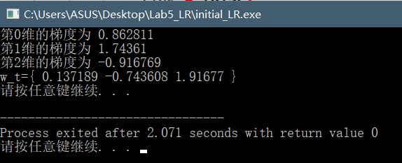
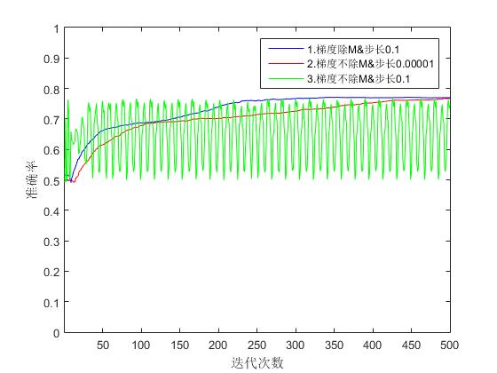
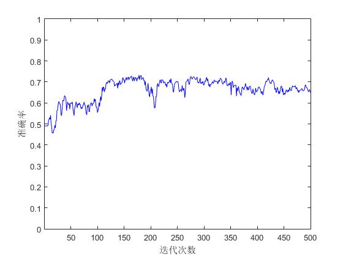
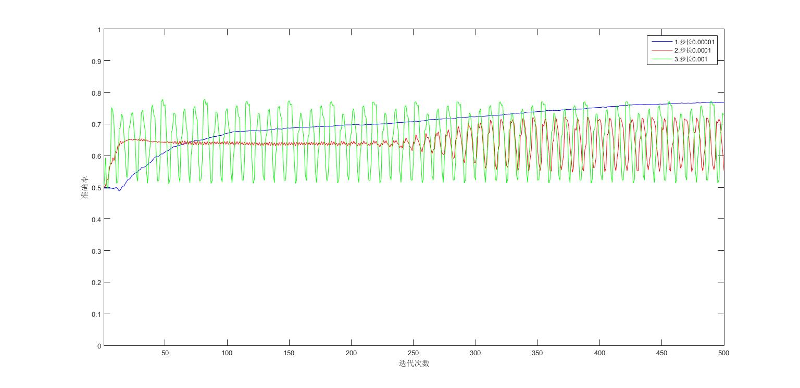

### <center>中山大学数据科学与计算机学院</center>

### <center>移动信息工程专业-人工智能</center>

### <center>本科生实验报告</center>

###<center>(2017-2018秋季学期)</center>

-------

|  姓名  |    学号    | 教学班级 |          课程名称           | 专业方向  |
| :--: | :------: | :--: | :---------------------: | :---: |
| 张子豪  | 15352427 | 15M1 | Artificial Intelligence | 移动互联网 |

-----


###一、实验题目

逻辑回归

###二、实验内容

####1.算法原理

$$\ \ \ \ \ \ $$逻辑回归模型是一个根据概率来分类的模型，目标函数$$f(x)=P(label|x)\in[0,1]$$ ，也就是特征向量x为label类的概率。

$$\ \ \ \ \ \ $$由于特征向量的每一个维度都会对结果产生影响，因此定义权重分数$$s=\sum_{i=0}^dw_ix_i=w^Tx$$ ，之所以用这样求和的方法，假如w与x之间为钝角，那么这个权重就会是负数，且夹角越大负数的绝对值越大；反之夹角为锐角的时候，权重为正，且二者越接近(夹角越小)则权重越大。也就是说，当特征向量与w越不接近的时候，它对结果的负影响会越大；特征向量与w越接近则对结果的正影响会越大。i从0开始则是因为这个式子实际上是$$\sum_{i=1}^dw_ix_i-\theta=\sum_{i=1}^dw_ix_i+(-\theta)*(+1)$$ ，那么将每个样本前面加上+1，这个式子就可以化简成$$\sum_{i=0}^dw_ix_i$$ 。

$$\ \ \ \ \ \ $$在得到了这个特征向量的权重之后，需要将这个权重映射为概率，即将$$(-\infty,+\infty)$$ 的权重映射到$$(0,1)$$ 的概率上，这里我们使用函数$$\theta(s)=\frac{1}{1+e^{-s}}$$ ，当权重s无穷小时$$\theta(-\infty)=0$$，也就是特征向量的负影响极大，该特征向量属于正类别的概率为0；当权重为0或无穷大的时候同理推论，这里不再赘述。

$$\ \ \ \ \ \ $$因此，我们可以用这个函数来表达逻辑回归模型: $$h(x)=\frac{1}{1+e^{-w^Tx}}$$ ，对每个特征向量x，得到的h(x)是它属于正类的概率，显而易见1-h(x)就是它属于负类的概率。那么，只要我们求出w，模型就构建完毕了。到这里，目标函数$$f(x)=P(label|x)=h(x)^y*(1-h(x))^{1-y}$$ ，y为x对应的分类标签，也就是label。

$$\ \ \ \ \ \ $$在某个模型下，根据给定数据x得到标签y的概率是这个问题的似然(likelihood)，我的理解是似然是这个模型有多大的可能根据x得到标签y，那么我们要做的是让模型最有可能根据x得到标签y，也就是需要让似然最大化。

$$\ \ \ \ \ \ $$似然函数$$likelihood=\prod_{i=1}^Mf(x_i)=\prod_{i=1}^Mh(x_i)^{y_i}(1-h(x_i))^{1-y_i}$$ ，需要使得这个式子最大。一般来说取极值的问题都会选择求导，考虑到连乘求导较为困难，因此将似然取对数，再取反，得到：

<center>$$-log(likelihood)=-log\prod_{i=1}^Mf(x_i)=-\sum_{i=1}^M[y_ilog(h(x_i))+(1-y_i)log(1-h(x_i))]$$ </center>

这个函数取最小值时，似然最大，对应的w也就是我们需要的w。由于这个函数是凹函数，当导数为0的时候就能取到最小值，因此对w进行求导：
$$
(-\sum_{i=1}^M[y_ilog(h(x_i))+(1-y_i)log(1-h(x_i))])^{'}\\ 
=-\sum_{i=1}^M[y_i*\frac{1}{h(x_i)}*(h(x_i))^{'}+(1-y_i)*\frac{1}{1-h(x_i)}*(1-h(x_i))^{'}] \\
=-\sum_{i=1}^M[\frac{y_i}{h(x_i)}*(h(x_i))^{'}-\frac{1-y_i}{1-h(x_i)}*(h(x_i))^{'}] \\
对于\frac{y_i}{h(x_i)}*(h(x_i))^{'}-\frac{1-y_i}{1-h(x_i)}*(h(x_i))^{'},该式=(\frac{y_i}{h(x_i)}-\frac{1-y_i}{1-h(x_i)})*(h(x_i))^{'} \\
=\frac{y_i(1-h(x_i))-(h(x_i)-y_i*h(x_i))}{h(x_i)*(1-h(x_i))}*(h(x_i))^{'} \\
=\frac{y_i-y_i*h(x_i)-h(x_i)+y_i*h(x_i)}{h(x_i)*(1-h(x_i))}*(h(x_i))^{'} \\
=\frac{y_i-h(x_i)}{h(x_i)*(1-h(x_i))}*(h(x_i))^{'}; \\
对于(h(x_i))^{'},(h(x_i))^{'}=(\frac{1}{1+e^{-w^Tx_i}})^{'}=-\frac{1}{(1+e^{-w^Tx_i})^2}*(1+e^{-w^Tx_i})^{'} \\
=\frac{x_i*e^{-w^Tx_i}}{(1+e^{-w^Tx_i})^2}=x_i*\frac{1}{1+e^{w^Tx_i}}*\frac{e^{w^Tx_i}}{1+e^{w^Tx_i}}=x_i*h(x_i)*(1-h(x_i)) \\
也就是说，\frac{y_i}{h(x_i)}*(h(x_i))^{'}-\frac{1-y_i}{1-h(x_i)}*(h(x_i))^{'}=\frac{y_i-h(x_i)}{h(x_i)*(1-h(x_i))}*(h(x_i))^{'} \\
=\frac{y_i-h(x_i)}{h(x_i)*(1-h(x_i))}*x_i*h(x_i)*(1-h(x_i))=x_i*(y_i-h(x_i)); \\
即(-\sum_{i=1}^M[y_ilog(h(x_i))+(1-y_i)log(1-h(x_i))])^{'}=\sum_{i=1}^M(x_i*(h(x_i)-y_i))
$$
$$\ \ \ \ \ \ $$而导数=0这个方程是无法求解的，那么需要利用梯度下降法。不断的迭代使w逼近最优解直至收敛。由此可以得到ppt上w的迭代公式：$$w_{new}^j=w_{cur}^j-\eta\sum_{i=1}^M[(\frac{1}{1+e^{-w^Tx_i}}-y_i)*x_i^j]$$ 。但是如果将损失函数定义为$$-\frac{1}{M}log(likelihood)$$ ，那么迭代公式就会是下面这个形式：

<center>$$w_{new}^j=w_{cur}^j-\eta*\frac{1}{M}*\sum_{i=1}^M[(\frac{1}{1+e^{-w^Tx_i}}-y_i)*x_i^j]$$ </center>

$$\ \ \ \ \ \ $$这也是我在博客中看到的另一种形式的迭代公式，个人认为这两种公式在梯度的方向上都是相同的，但是前者的模较大，而后者的模因为乘了1/M所以较小，这也就导致在迭代的时候前者的步长需要取的很小，而后者的步长可以稍微取大一点。而在这次实验中，使用第二个公式的收敛速度较第一个公式相比要快一些，因此在最终的模型里我使用了第二个公式。这两个公式对结果影响的详细比较在实验结果及分析中给出。

$$\ \ \ \ \ \ $$利用得到的迭代公式，不断的迭代求解w直到梯度为0或者迭代足够多次，就可以完成逻辑回归模型的构建。

####2.伪代码

构建逻辑回归模型：

---

Input: 特征向量集合{**x**} ,标签集合{y} 

Output: 向量$$w_t$$ 

step1: 初始化	向量$$w_0$$ ={1,1,1,...,1}

step2: 计算每个维度的梯度$$\triangledown Err(w_{t,i})=\sum_{n=1}^N(\frac{1}{1+e^{-w_t^Tx_n}}-y_i)x_{n,i}$$ 

step3: 迭代更新$$w_t$$ 的每一个维度$$w_{t+1,i}=w_{t,i}-\eta*\triangledown Err(w_{t,i})$$ 

step4: if $$\triangledown Err(w)=0$$ 或迭代足够次数 $$\ \ $$ 结束程序

$$\ \ \ \ \ \ \ \ \ \ \ $$else $$goto \ step2$$  

---

预测算法：

---

Input: 特征向量**x** , 向量$$w_t$$ 

Output: 该特征向量对应标签y

step1: 计算$$dot=x\cdot w_t$$ 

step2: $$if\ dot>=0\ $$ 预测为1

$$\ \ \ \ \ \ \ \ \ \ \ $$$$else$$ 预测为0

---

####3.关键代码截图(带注释)

```c++
void Get_w(int num_iterations,double step) { //传入迭代次数和学习率，获得w
	for (int i = 0; i < num_iterations; i++) { //迭代次数
		vector<double> s;//权重分数，每次迭代更新
		for (int j = 0; j < train.size(); j++) { //遍历训练集计算权重积分
			s.push_back(calc(w0, train[j].data));
		}

		vector<double> gradient;//每一维的梯度
		for (int j = 0; j < w0.size(); j++) { //遍历每一维
			double grad = 0;
			for (int k = 0; k < train.size(); k++) { //在这一维上遍历训练集
				grad += ((1.0 / (1 + pow(e, -s[k]))) - train[k].label)*train[k].data[j];
			}
			gradient.push_back(grad/train.size());
		}

		bool flag = true;
		for (int j = 0; j < gradient.size(); j++) { //确认梯度是否为0
			if (gradient[j] >=1e-5) {
				flag = false;
				break;
			}
		}
		if (flag) { ////梯度为0则跳出
			cout << "迭代次数" << i + 1 << "已收敛" << endl;
			break;
		}

		for (int j = 0; j < w0.size(); j++) { //更新w0
			w0[j] -= (gradient[j] * step);
		}
	}
}
```

####4.创新点 &优化(如果有)

1. 随机梯度下降

   由于批梯度下降更新参数时需要遍历所有样本，当样本数据很大时批梯度算法的耗时会十分巨大。因此提出了随机梯度下降，每次迭代随机取一个样本，只考虑让该样本点的-log(likelihood)最小，而不管其他样本点。随机梯度下降时间复杂度会低很多，但是收敛过程会十分曲折，简单来说，看脸。这种方法只能接近局部最优解，而无法真正得到局部最优解，在精度要求不高的情况下，一般适用于数据集较大的情况。

   随机梯度下降实现起来并不困难，将迭代公式改为$$w_{new}^j=w_{cur}^j-\eta*[(\frac{1}{1+e^{-w^Tx_i}}-y_i)*x_i^j]$$ ，样本$$x_i$$每次迭代随机选取。代码如下：

   ```c++
   void Get_w(int num_iterations,double step) {
   	for (int i = 0; i < num_iterations; i++) { //迭代次数
   		vector<double> s;//权重分数，每次迭代更新
   		for (int j = 0; j < train.size(); j++) { //遍历训练集计算权重积分
   			s.push_back(calc(w0, train[j].data));
   		}

   		vector<double> gradient;//每一维的梯度
   		for (int j = 0; j < w0.size(); j++) { //遍历每一维
   			int k= (train.size()*(rand() / (RAND_MAX + 1.0)));
   			double grad = ((1.0 / (1 + pow(e, -s[k]))) - train[k].label)*train[k].data[j];
   			gradient.push_back(grad/train.size());
   		}

   		bool flag = true;
   		for (int j = 0; j < gradient.size(); j++) { //确认梯度是否为0
   			if (gradient[j] >=1e-5) {
   				flag = false;
   				break;
   			}
   		}
   		if (flag) { ////梯度为0则跳出
   			cout << "迭代次数" << i + 1 << "已收敛" << endl;
   			break;
   		}

   		for (int j = 0; j < w0.size(); j++) { //更新w0
   			w0[j] -= (gradient[j] * step);
   		}
   	}
   }
   ```

2. 动态学习率改变

   当梯度离最优值相差较远时，可以将学习率设置较大，而当梯度下降到接近最优值时，将学习率降低。这样有助于加快收敛速度。要实现这种方法的话只需要让学习率随着迭代次数增加而减小就可以了，本次实验中我使用的函数是$$alpha=\frac{4}{1+i+k}+0.08$$ ，其中i是当前迭代次数，k是维度，加上一个常数是为了当迭代进行到一定程度时仍然能够保证学习率不会太低导致收敛过慢。

###三、实验结果及分析

####1.实验结果展示示例（可图可表可文字，尽量可视化）

使用小数据集验证结果，小数据集如下，学习步长设为1，迭代1次，初始化$$w_0=\{1,1,1\}$$ 

```
  No   Attribute1   Attribute2   Label
train1    1             2          1
train2    2            -1          0
```

首先计算每个样例的权重：

$$train1: s_1=w_0\cdot x_1=1*1+1*1+2*1=4 $$

$$train2: s_2=w_0\cdot x_2=1*1+1*2+1*(-1)=2$$

然后计算每一维的梯度：

$$\triangledown Err(w_{0,0})=(\frac{1}{1+e^{-4}}-1)*1+(\frac{1}{1+e^{-2}}-0)*1\doteq0.862810868 $$

$$\triangledown Err(w_{0,1})=(\frac{1}{1+e^{-4}}-1)*1+(\frac{1}{1+e^{-2}}-0)*2\doteq1.743607946 $$

$$\triangledown Err(w_{0,2})=(\frac{1}{1+e^{-4}}-1)*2+(\frac{1}{1+e^{-2}}-0)*(-1)\doteq-0.9167694979 $$ 

根据计算出的梯度更新$$w$$ ，即

$$w_1=\{0.13718132,-0.743607946,1.916769498\}$$ 

而程序运行结果如下：



至此，可以说明算法运行正确。

####2.评测指标展示即分析（以下指标均在验证集上测试）

将所给数据随机划分七成作为训练集，剩余部分作为验证集，即7:3划分。

首先，对于前面实验原理提到的两组公式(梯度除M和梯度不除M)，我进行五百次迭代，每次迭代输出准确率进行绘图，如下



对于1和2(即梯度除M&步长0.1和梯度不除M&步长0.000001)，二者随着迭代进行准确率都稳定上升，且最终都趋于平滑，这里也就证明了我在实验原理中的猜想(这两条公式的影响只是所取步长不同)。这两条公式的准确率最后都约为0.78。

而对于3，当步长取到0.1时，显然步长过大。当w即将到达最优值时下一次迭代，由于步长过大，w会在最优解右边，此时由于离最优解过远，因此准确率最低，对应图中的峰底；再下一次迭代会让w回到接近最优解的位置，此时准确率较高，对应图中的峰顶。因此，才会有这样正弦波的图形出现。

使用随机梯度下降法，同样进行五百次迭代，绘图如下



可以说是相当的随缘了，图中可以看出一百多次下降后就出现了一组准确率0.7以上的$$w_t$$ ，而迭代到两百多次点后出现了一组只有0.5+的$$w_t$$ ，波动很大。不过随机梯度下降的耗时短的优点可以说是体现的淋漓尽致了，运气好迭代几十次一百次就能得到准确率0.7+的$$w_t$$ ，而相同迭代次数下的批梯度下降法的准确率只有0.6左右。

### 四、思考题

1. 如果把梯度为0作为算法停止的条件，可能存在怎样的弊端？

   答：首先，如果数据集较为复杂的话，从w0的位置下降到最优解可能需要很长很长时间，算法会运行很久。因此需要另外设置迭代次数，当迭代次数超过阈值时结束迭代。

   然后，一般情况下我们给的学习率并不能让梯度恰好下降到0，这样的话如果不限定迭代次数梯度就会在0附近不停震荡，但其实这种情况已经是应该停止算法输出w了。这种情况可以通过限定迭代次数或者将阈值从0变成一个很小的值(比如1e-5)来解决。

2. 𝜂的大小会怎么影响梯度下降的结果？给出具体的解释，可视化的解释最好，比如图形展示等。

   答：取步长0.00001,0.001,0.1，绘图如下

   

   显而易见，假如步长过大的话，在下降到接近最优点的时候下一次迭代时$w_{t+1}$会因为步长过大跑到最优点的右边，然后再下一次迭代又会回到最优点的左边且接近最优点的位置，因此会出现这种正弦波的情况。

   步长过小的话，收敛速度过慢，需要迭代很多次才能下降到接近最优点的位置。

3. 思考批梯度下降与随机梯度下降的优缺点。

   批梯度下降：

   * 优点：可以确保到达最优解的位置，精度高，且收敛速度较随机梯度下降相比要快
   * 缺点：由于每次迭代的每个维度都需要遍历整个训练集，因此耗时长，当数据集规模庞大时不适用

   随机梯度下降：

   * 优点：每次迭代随机取一个样本，只考虑让该样本点的-log(likelihood)最小，而不管其他样本点，因此耗时短，适用于数据集规模庞大且精度要求不高的模型
   * 缺点：不一定能到达最优解，精度不够高，且收敛过程曲折、漫长