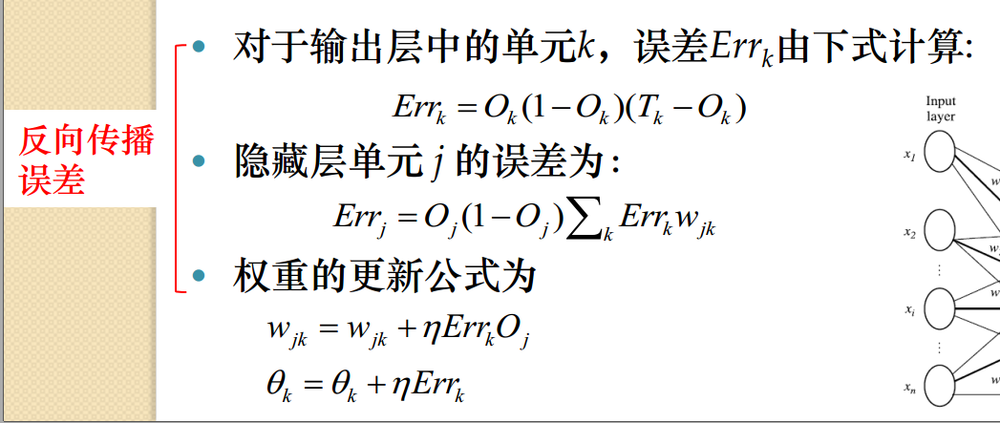
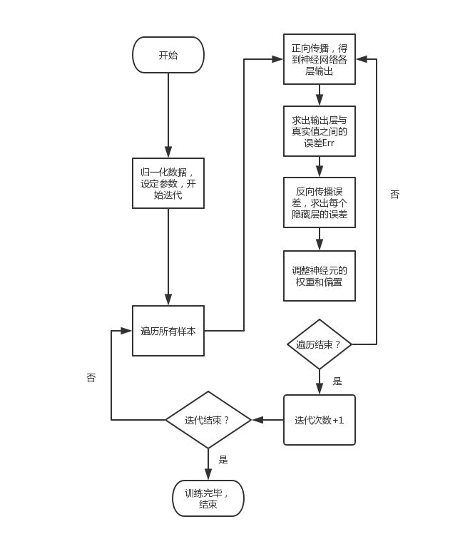
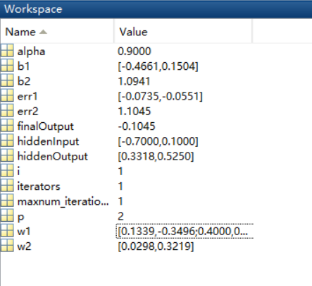
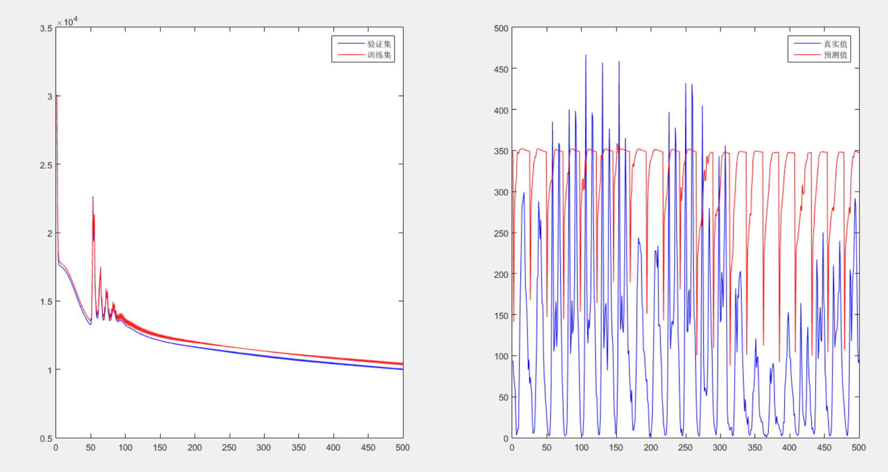

### <center>中山大学数据科学与计算机学院</center>

### <center>移动信息工程专业-人工智能</center>

### <center>本科生实验报告</center>

###<center>(2017-2018秋季学期)</center>

-------

|  姓名  |    学号    | 教学班级 |          课程名称           | 专业方向  |
| :--: | :------: | :--: | :---------------------: | :---: |
| 张子豪  | 15352427 | 15M1 | Artificial Intelligence | 移动互联网 |

-----


###一、实验题目

BPNN——后向传播神经网络

###二、实验内容

####1.算法原理

一个神经网络由多个单一神经元构成，而神经元图示如下


这个神经元是一个样本为$$x_1,x_2,x_3$$ 以及截距+1作为输入的运算单元，数据输入到神经元的值为$$W^Tx=\sum_{i=1}^3W_ix_i+b$$ ，其中b为这个神经元的偏置项，$$W$$ 为这个神经元的权重向量，都是这个神经元的参数。输入值经过神经元激活后便得到了输出值$$h_{w,b}(x)$$ ，即$$h_{w,b}=f(W^Tx)$$ ，$$f(x)$$ 是这个神经元的激活函数，即将输入值经过某种转换得到输出值。

所谓神经网络，就是将许多个这样的神经元连接在一起，某个神经元的输出作为另一个神经元的输入，下图就是一个简单的BP神经网络


Layer L1为输入层，即样本每个维度的值加上截距。Layer L2为隐藏层(因为不能直接观测到该层的值)，接受来自输入层的输出，经过激活后输出给Layer L3。Layer L3为输出层，将输入经过激活后得到的结果作为神经网络最终的输出。

对于除了输入层的所有神经元，都有它的参数：权重向量$$W$$ 与偏置项b，而我们需要做的，就是训练出一组参数，使得在这组参数下的神经网络得到的输出值最接近样本的真实值。这个学习过程是一个有监督的学习过程，即对于每一个输入得到输出后，计算输出值与真实值之间的误差，然后将这个误差反向传递来依次修正$$W$$和b。

用$$W_{ij}^l$$ 来表示第l层第i个单元与第l+1层第j个单元的连接权重，$$b_i^l$$ 是第l+1层第i个单元的偏置项，$$a_i^l$$ 来表示第l层第i个单元的输出。那么对于上图中的神经网络，前向传播得到输出的计算步骤如下：
$$
a_1^2=f(\sum_{i=1}^3W_{i1}^1x_i+b_1^1) \\
a_2^2=f(\sum_{i=1}^3W_{i2}^1x_i+b_2^1) \\
a_3^2=f(\sum_{i=1}^3W_{i3}^1x_i+b_3^1) \\
h_{W,b}(x)=f(\sum_{i=1}^3W_{i1}^2a_i^2+b_1^2)   \ \ \ as\ final\ output
$$
使用matlab或者python的np库进行矩阵计算较上面这种逐个点计算的方式要快得多：
$$
\vec{hiddenOutput}=f(\vec{X}*\vec{W^1}+\vec{b^1}) \\
finalOutput=f(\vec{hiddenOutput}*\vec{W^2}+\vec{b^2})
$$
对于一个神经网络模型，定义损失函数为均方差$$MSE=\frac{1}{2}\sum_{i=1}^n(Y_i^{'}-Y_i)^2$$  ，我们需要使得这个模型的损失最小，考虑使用批梯度下降法，让每个样本的权重都向其负梯度方向变化来完成这个工作。

本次实验中隐藏层的激活函数为$$sigmoid$$ 函数: $$f(x)=\frac{1}{1+e^{-x}}$$ ，对其求导为$f^{'}(x)=f(x)*(1-f(x))$。输出层的激活函数为线性函数$$f(x)=x$$ ,其求导为1。

而对每条样本，损失函数梯度为$$\frac{\partial \ loss}{\partial w_i}=\frac{\partial \frac12(Y'-Y)^2}{\partial w_i}=(Y'-Y)\frac{\partial Y'}{\partial w_i}=(Y'-Y)\frac{\partial f(\sum_jw_jx_j+b_i)}{\partial w_i}=$$ $$(Y-Y')*f'(\sum_jw_jx_j+b_i)*\frac{\partial \sum_jw_jx_j}{\partial w_i}=(Y-Y')*f'(\sum_jw_jx_j+b_i)* x_i$$ ，其中$x_i$ 为上一层的对应输出。

同理，$$\frac{\partial \ loss}{\partial b_i}=(Y'-Y)*f'(\sum_jw_jx_j+b_i)$$ 。

这样，得到梯度后沿着误差的负梯度方向去更新，就可以得到pdf上的更新公式:



由于实验中我们使用的输出层激活函数为线性函数，因此$Err_k$ 应该等于$T_k-O_k$ 。


####2.伪代码



####3.关键代码截图(带注释)

考虑到C++进行神经网络迭代逐个点进行的效率非常慢，因此这次实验我采用了C++与matlab混合编程，C++处理数据，matlab读取数据后迭代计算。

本来是想把整个数据集丢直接丢进去，然而发现我的matlab版本有点低，不支持m*n矩阵与1\*n矩阵的相加，因此要多写一个for循环来遍历整个样本，这样效率会低很多。迭代的代码如下：

```matlab
for iterators=1:maxnum_iterations %迭代次数
    w2_tmp=w2;
    w1_tmp=w1;
    b1_tmp=b1;
    b2_tmp=b2;
    for i=1:row %遍历所有样本
        %正向遍历
        hiddenInput=data(i,:)*w1_tmp+b1_tmp;% 1*p矩阵
        hiddenOutput=1./(1+exp(-1*hiddenInput)); % 1*p矩阵
        finalOutput=hiddenOutput*w2_tmp'+b2_tmp;
        %反向遍历
        err2=cnt(i)-finalOutput; %输出层误差
        err1=err2*hiddenOutput.*(1-hiddenOutput).*w2_tmp; %隐藏层误差 1*p矩阵
        %更新权重
        w2=w2+alpha*err2*hiddenOutput;
        w1=w1+alpha*data(i,:)'*err1;
        b2=b2+alpha*err2;
        b1=b1+alpha*err1;
    end
    disp(iterators);
end
```

####4.创新点 &优化(如果有)

1. 数据预处理：

   我们在建立模型前需要处理掉数据集中不会对结果产生影响的列。我认为这次实验中不会对结果产生影响的列中，首先是编号和日期这两列不会对结果产生影响，然后由于所给数据全部是2011年的数据，所以年份那一列其实是全0，因此也可以去掉。

   然后对所有列进行归一化，确保不会因为某些列数值过大而对权重产生较大影响。我所使用的归一化函数是$\frac{x_i-min+1}{max-min+1}$ ，分子分母都+1确保某一列所有元素都相同时依然能够归一化。

2. 不同神经网络架构：

   使用不同的激活函数便可以设计不同的神经网络架构。我尝试了使用双曲正切函数tanh：$f(x)=\frac{e^x-e^{-x}}{e^x+e^{-x}}=\frac{e^{2x}-1}{e^{2x}+1}$ ，那么$f'(x)=1-f(x)^2$ ，同样利用梯度下降来完成迭代建模。

   ```matlab
   for iterators=1:maxnum_iterations %迭代次数
       w2_tmp=w2;
       w1_tmp=w1;
       b1_tmp=b1;
       b2_tmp=b2;
       for i=1:row %遍历所有样本
           %正向遍历
           hiddenInput=data(i,:)*w1_tmp+b1_tmp;% 1*p矩阵
           hiddenOutput=(exp(2*hiddenInput)-1)./(exp(2*hiddenInput+1)); % 1*p矩阵
           finalOutput=hiddenOutput*w2_tmp'+b2_tmp;
           %反向遍历
           err2=cnt(i)-finalOutput; %输出层误差
           err1=err2*(1-hiddenOutput*hiddenInput).*w2_tmp; %隐藏层误差 1*p矩阵
           %更新权重
           w2=w2+alpha*err2*hiddenOutput;
           w1=w1+alpha*data(i,:)'*err1;
           b2=b2+alpha*err2;
           b1=b1+alpha*err1;
       end
       disp(iterators);
   end
   ```

###三、实验结果及分析

####1.实验结果展示示例（可图可表可文字，尽量可视化）

使用小数据集来展示实验结果。小数据集如下只有一个样本x={1,0,1},标签为1，三层神经网络，隐藏层拥有两个节点，权重向量及偏置初始化如下
$$
W_1=
\left\{
\begin{matrix}
0.2 &-0.3\\
0.4&0.1\\
-0.5&0.2\\
\end{matrix}
 \right\}\\
  \ \\

 W_2=
\left\{
\begin{matrix}
-0.3&-0.2
\end{matrix}
 \right\}\\
 \ \\

  b_1=
\left\{
\begin{matrix}
-0.4 & 0.2
\end{matrix}
 \right\}\\
 \ \\
 
 b_2=0.1
$$
笔算结果为

```
隐藏层输入={-0.7,0.1}
隐藏层输出={0.332,0.525}
输出结果=-0.1045
输出层误差=真实值-预测值=1.1045
隐藏层误差=hiddenOutput.*(1-hiddenOutput)*err2.*w2={-0.0735,-0.0551}
w1=0.1339  -0.3496  (w1=w1+α*x'*err1)
   0.4     0.1
   -0.5661 0.1504
w2={0.0298,0.3219}  (w2=w2+α*err2*hiddenoutput)
b1={-0.4661,0.1504}
b2=1.0941
```

而matlab运行结果如下



与运行结果完全吻合。

####2.评测指标展示即分析（如果实验题目有特殊要求，否则使用准确率）

将所给数据随机抽取七成作为训练集，其余作为验证集。每次迭代过程都输出当前模型的均方差，为下图左，横坐标为迭代次数，纵坐标为均方差。下图右为迭代500次后选择12月最后20天（即抽取最后五百个样本）来预测结果，并对比预测值和真实值。



最后得到的模型在验证集和训练集上的loss接近，因此可以认为模型没有过拟合。有趣的是在进行50次迭代左右的时候有一个很大的震荡，个人认为可能是步长较大，而损失函数在那一处有一个局部最大点，于是就出现了这样loss突然上飙的情况。之后损失函数就在平稳下降了。

### 四、思考题

1. 尝试说明下其他激活函数的优缺点。

   答：sigmoid函数：

   优点：能够将连续的实值映射到(0,1)之间

   缺点：当输入较大或者较小时，输出就会非常接近1或非常接近0，此时的梯度也接近0，这会导致在反向传播中对权重的更新非常非常小。

   tanh函数：

   优点：能够将连续的实值映射到(-1,1)之间

   缺点：同样的，当输入较大或较小时，输出同样接近1或接近0，梯度接近为0，在反向传播的过程中同样对权重机会没有更新。

   ReLU函数：max(0,x)

   优点：将数据映射到[0,|x|]， 由于是线性函数，因此梯度稳定，不会出现像上面两种函数接近0的情况，且不需要进行指数计算，复杂度低。

   缺点：假如当某个神经元的输入为负数时，这个神经元的梯度就会被置零，那么这样一来这个神经元不管输入任何数据都不会对梯度产生修正，该神经元的梯度会永远为0。

2. 有什么方法可以实现传递过程中不激活所有节点？

   答：dropout。即在激活的过程中，让某个神经元的激活值以某个概率变为0，这样这个神经元就暂时停止工作了。dropout可以有效阻止过拟合，原因是通过阻止某些特征之间的协同作用（个人理解是，比如天气的好坏会影响到出行人数）来缓解过拟合，那么dropout不激活所有节点，使得一个神经元的出现不依赖于另一个神经元，即模型平均，这样可以有效阻止过拟合。

3. 梯度消失和梯度爆炸是什么？可以怎么解决？

   答：神经网络之间由链式法则来求得各个隐藏层的梯度。以sigmoid函数为例，它将数据映射到(0,1)之间，导数为fx(1-f(x))，当神经网络层数较多的时候，越远离输出层的隐藏层，求梯度时就要用链式法则来经历越多次连乘，而两个0~1之间的数相乘必然会变小，那么连乘下去，可能会导致中间某一层的梯度接近于0，而此时对应的权重可以说是接近没有更新，这就是梯度消失，即只有后几层的浅层网络在学习。

   而梯度爆炸则是指初始化的权值过大，这样前面层变化较后面层要快的多，从而导致权值越来越大，梯度爆炸也就发现了。但其实这种情况在使用sigmoid函数作为激活函数的时候很少见。这两种情况其实都是网络层数太深或者权值更新不稳定造成的。

   解决方法的话，可以考虑减小神经网络层数，也可以考虑使用ReLu函数来代替sigmoid作为激活函数，ReLU函数的优点上面也有提到，梯度稳定，但对于可能会出现的梯度永远为0的情况，可以考虑减小步长来解决。